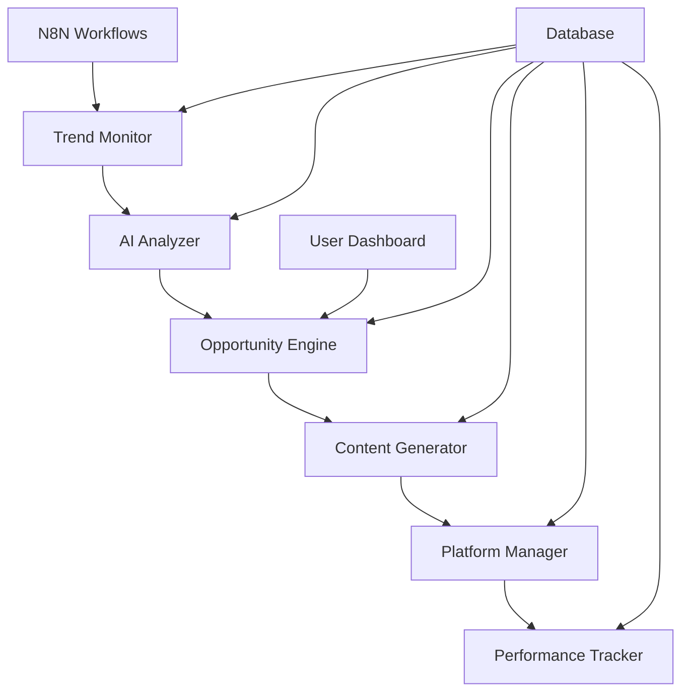

# 🤖 AI Content Factory

> **Automated Content Creation & Social Media Management Platform**
> 
> Transform trending topics into viral content across multiple platforms using AI-powered automation.

<div align="center">

[](https://github.com/ai-content-factory)
[](LICENSE)
[](https://github.com/ai-content-factory/actions)
[](docker-compose.yml)
[](https://nodejs.org/)

[🚀 Quick Start](#-quick-start) • 
[📚 Documentation](#-documentation) • 
[🎯 Features](#-features) • 
[🛠️ Installation](#️-installation) • 
[🤝 Contributing](#-contributing)

</div>

---

## 🎯 What is AI Content Factory?

AI Content Factory is an intelligent automation platform that:

- 🔍 **Monitors trending topics** across YouTube, Google Trends, Reddit, and Twitter
- 🧠 **Analyzes opportunities** using advanced AI algorithms
- 🎬 **Generates content** (scripts, images, audio) automatically
- 📤 **Publishes to platforms** (YouTube, TikTok, Instagram, Facebook) seamlessly
- 📊 **Tracks performance** and optimizes content strategy

### 💡 Perfect For:
- **Content Creators** looking to scale their production
- **Digital Marketers** managing multiple social media accounts
- **Businesses** wanting to maintain consistent online presence
- **Agencies** serving multiple clients efficiently

---

## ✨ Key Features

### 🔍 **Intelligent Trend Analysis**
- Real-time monitoring of trending topics
- AI-powered opportunity scoring (1-10 scale)
- Competition analysis and market gap identification
- Multi-platform trend correlation

### 🎬 **AI Content Generation**
- **Script Writing**: Hooks, main content, and CTAs
- **Visual Creation**: Images, thumbnails, and graphics
- **Audio Production**: Text-to-speech with multiple voices
- **Video Assembly**: Automated video compilation

### 📱 **Multi-Platform Publishing**
- **YouTube**: Complete video uploads with optimized metadata
- **TikTok**: Short-form content with trending hashtags
- **Instagram**: Stories, posts, and Reels
- **Facebook**: Pages and groups management

### 📊 **Performance Analytics**
- Real-time performance tracking
- ROI calculation and optimization
- A/B testing for content variants
- Detailed engagement analytics

### 🔧 **Quality Tiers**
- **Budget Tier**: Cost-effective with basic AI models
- **Balanced Tier**: Optimized price-performance ratio
- **Premium Tier**: Highest quality with advanced AI

---

## 🏗️ System Architecture



### 🧩 Core Components:

- **🔍 Trend Monitor**: Collects trending data from multiple sources
- **🧠 AI Director**: Orchestrates content creation using multiple AI services
- **⚙️ Content Engine**: Generates scripts, images, and audio
- **📤 Platform Manager**: Handles multi-platform publishing
- **📊 Analytics Engine**: Tracks performance and ROI
- **🖥️ Web Dashboard**: User interface for management and monitoring

---

## 🚀 Quick Start

### Prerequisites
- **Node.js** 18+ 
- **Docker** & Docker Compose
- **PostgreSQL** 13+
- **Redis** 6+

### ⚡ One-Command Setup
```bash
# Clone and start the entire system
git clone https://github.com/your-org/ai-content-factory.git
cd ai-content-factory
cp .env.example .env
docker-compose up -d
```

### 🌐 Access Your Dashboard
- **Main Dashboard**: http://localhost:3000
- **N8N Workflows**: http://localhost:5678
- **API Documentation**: http://localhost:5000/docs

📖 **[Complete Installation Guide →](docs/deployment/local-setup.md)**

---

## 🛠️ Installation Options

### 🐳 Docker (Recommended)
```bash
# Development environment
docker-compose up -d

# Production environment
docker-compose -f docker-compose.prod.yml up -d
```

### 📦 Manual Installation
```bash
# Install dependencies
npm install

# Setup database
npm run db:setup

# Start services
npm run dev
```

### ☁️ Cloud Deployment
```bash
# Kubernetes
kubectl apply -f kubernetes/

# Heroku
git push heroku main
```

**[View all deployment options →](docs/deployment/)**

---

## 🎮 Usage Examples

### 🔍 Monitor Trends
```javascript
// Automatically collect trending topics
const trends = await trendMonitor.collectTrends();
console.log(`Found ${trends.length} trending topics`);
```

### 🎬 Generate Content
```javascript
// Create content from trending topic
const opportunity = await opportunityEngine.selectBest();
const content = await contentGenerator.create(opportunity);
```

### 📤 Publish Everywhere
```javascript
// Upload to all platforms
const results = await platformManager.publishToAll(content);
console.log(`Published to ${results.length} platforms`);
```

**[View complete API documentation →](docs/api/)**

---

## 📊 Performance

### 🚀 **Speed**
- **Trend Analysis**: < 30 seconds
- **Content Generation**: 2-5 minutes
- **Multi-platform Upload**: 1-3 minutes per platform

### 💰 **Cost Efficiency**
- **Budget Tier**: ~฿15 per video
- **Balanced Tier**: ~฿35 per video
- **Premium Tier**: ~฿75 per video

### 📈 **Scale**
- **Concurrent Generation**: Up to 50 videos
- **Daily Capacity**: 500+ videos
- **Platform Support**: 4+ major platforms

---

## 🔧 Configuration

### 🎛️ **Quality Tiers**
```yaml
# config/quality_tiers.yaml
budget:
  text_ai: groq
  image_ai: stable_diffusion
  cost_per_video: 15

premium:
  text_ai: claude
  image_ai: midjourney
  cost_per_video: 75
```

### 🌐 **Platform Settings**
```yaml
# config/platforms.yaml
youtube:
  enabled: true
  auto_upload: true
  optimization: high

tiktok:
  enabled: true
  hashtag_strategy: trending
```

**[Complete configuration guide →](docs/guides/configuration.md)**

---

## 📚 Documentation

### 📖 **User Guides**
- [🚀 Quick Start Guide](docs/guides/quick-start.md)
- [⚙️ Configuration Guide](docs/guides/configuration.md)
- [🎯 Best Practices](docs/guides/best-practices.md)
- [❓ Troubleshooting](docs/guides/troubleshooting.md)

### 🔧 **Technical Documentation**
- [🏗️ Architecture Overview](docs/architecture.md)
- [🔌 API Reference](docs/api/)
- [🚀 Deployment Guide](docs/deployment/)
- [🧪 Testing Guide](docs/testing/)

### 👨‍💼 **Admin Guides**
- [📊 Monitoring & Analytics](docs/guides/admin-guide.md)
- [🔒 Security Configuration](docs/security/)
- [📦 Backup & Recovery](docs/backup/)

---

## 🌟 Key Benefits

### ⏰ **Save Time**
- **90% reduction** in content creation time
- **Automated publishing** to multiple platforms
- **24/7 trend monitoring** without manual intervention

### 💰 **Increase Revenue**
- **Higher posting frequency** = more opportunities for viral content
- **Data-driven content** based on actual trending topics
- **Multi-platform presence** maximizes audience reach

### 📈 **Scale Efficiently**
- **Consistent content quality** across all platforms
- **Automated A/B testing** for optimization
- **Performance analytics** for continuous improvement

---

## 🎯 Supported Platforms

| Platform | Upload | Analytics | Optimization |
|----------|--------|-----------|--------------|
| YouTube | ✅ | ✅ | ✅ |
| TikTok | ✅ | ✅ | ✅ |
| Instagram | ✅ | ✅ | ✅ |
| Facebook | ✅ | ✅ | ✅ |
| Twitter | 🚧 | 🚧 | 🚧 |
| LinkedIn | 📋 | 📋 | 📋 |

- ✅ Fully Supported
- 🚧 In Development
- 📋 Planned

---

## 🤝 Contributing

We welcome contributions from the community! 

### 🔄 **Quick Contributing**
1. Fork the repository
2. Create a feature branch (`git checkout -b feature/amazing-feature`)
3. Commit your changes (`git commit -m 'Add amazing feature'`)
4. Push to the branch (`git push origin feature/amazing-feature`)
5. Open a Pull Request

### 📋 **Contribution Guidelines**
- Follow the [Contributing Guide](CONTRIBUTING.md)
- Ensure all tests pass
- Update documentation as needed
- Follow our code style guidelines

**[View detailed contributing guide →](CONTRIBUTING.md)**

---

## 🆘 Support & Community

### 💬 **Get Help**
- 📧 **Email**: support@aicontentfactory.com
- 💬 **Discord**: [Join our community](https://discord.gg/aicontentfactory)
- 📚 **Documentation**: [docs.aicontentfactory.com](https://docs.aicontentfactory.com)
- 🐛 **Issues**: [GitHub Issues](https://github.com/ai-content-factory/issues)

### 🌟 **Community**
- Share your success stories
- Request new features
- Help others in the community
- Contribute to development

---

## 📜 License

This project is licensed under the MIT License - see the [LICENSE](LICENSE) file for details.

### 📋 **Third-Party Licenses**
- OpenAI API: [OpenAI Terms](https://openai.com/terms)
- Claude API: [Anthropic Terms](https://anthropic.com/terms)
- YouTube API: [Google Terms](https://developers.google.com/terms)

---

## 🔮 Roadmap

### 🎯 **Version 1.1** (Q2 2024)
- [ ] Advanced AI models (GPT-4, Claude-3)
- [ ] Real-time collaboration features
- [ ] Enhanced analytics dashboard
- [ ] Mobile app (iOS/Android)

### 🚀 **Version 1.2** (Q3 2024)
- [ ] Video generation with AI avatars
- [ ] Advanced scheduling and automation
- [ ] Enterprise features and SSO
- [ ] API marketplace integration

### 🌟 **Version 2.0** (Q4 2024)
- [ ] Multi-language content generation
- [ ] Advanced competitor analysis
- [ ] Custom AI model training
- [ ] White-label solutions

**[View complete roadmap →](docs/ROADMAP.md)**

---

## 📊 Statistics

<div align="center">

| Metric | Value |
|--------|-------|
| **Lines of Code** | 50,000+ |
| **Services** | 6 Core + 4 Supporting |
| **API Endpoints** | 100+ |
| **Test Coverage** | 85%+ |
| **Docker Images** | 8 |
| **Supported Languages** | Thai, English |

</div>

---

## ⭐ Star History

[](https://star-history.com/#ai-content-factory/ai-content-factory&Date)

---

## 🙏 Acknowledgments

Special thanks to:
- [OpenAI](https://openai.com) for GPT models
- [Anthropic](https://anthropic.com) for Claude AI
- [N8N](https://n8n.io) for workflow automation
- [Docker](https://docker.com) for containerization
- All our amazing contributors and community members

---

<div align="center">

**Made with ❤️ by the AI Content Factory Team**

[🌟 Star this project](https://github.com/ai-content-factory/ai-content-factory) • 
[🐛 Report Bug](https://github.com/ai-content-factory/issues) • 
[💡 Request Feature](https://github.com/ai-content-factory/issues)

---

**© 2024 AI Content Factory. All rights reserved.**

</div>