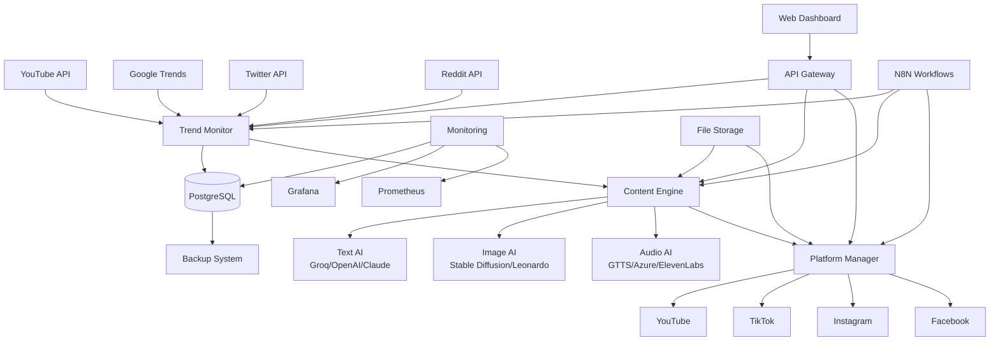
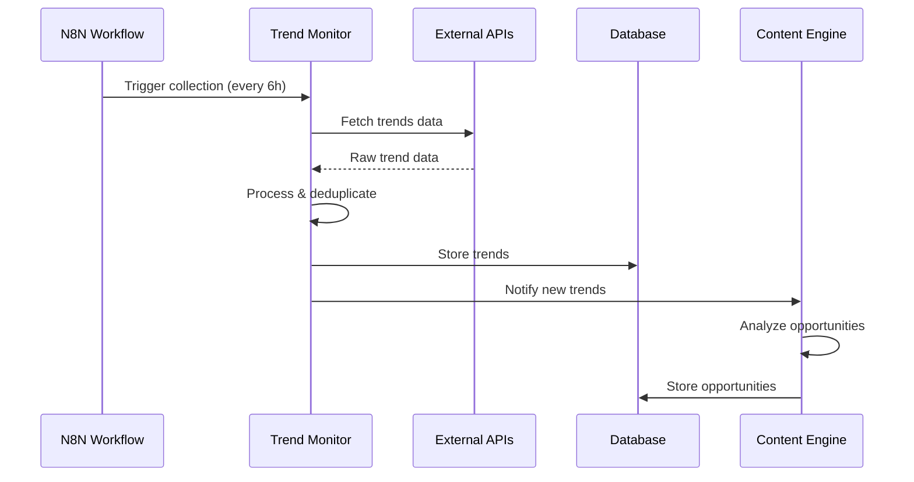
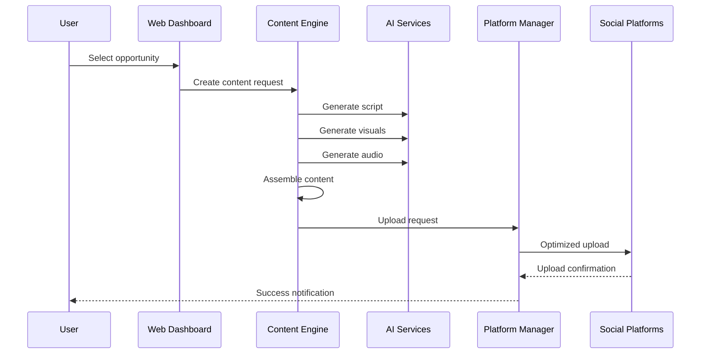

# AI Content Factory - System Architecture

## 📋 Table of Contents
- [Overview](#overview)
- [System Architecture](#system-architecture)
- [Core Components](#core-components)
- [Data Flow](#data-flow)
- [Technology Stack](#technology-stack)
- [Deployment Architecture](#deployment-architecture)
- [Security Architecture](#security-architecture)
- [Performance & Scalability](#performance--scalability)
- [Integration Patterns](#integration-patterns)

## Overview

AI Content Factory is a comprehensive automated content creation platform that leverages artificial intelligence to monitor trends, generate content opportunities, create multimedia content, and distribute across multiple platforms.

### Key Capabilities
- **Trend Intelligence**: Real-time monitoring of YouTube, Google Trends, Twitter, and Reddit
- **AI-Powered Analysis**: Intelligent opportunity scoring and content angle generation
- **Automated Content Creation**: Text, image, and audio generation using multiple AI services
- **Multi-Platform Distribution**: Automated uploads to YouTube, TikTok, Instagram, and Facebook
- **Performance Analytics**: Content performance tracking and ROI analysis

## System Architecture



## Core Components

### 1. Trend Monitor Service
**Purpose**: Collects and analyzes trending topics from multiple sources

**Components**:
- `TrendCollector`: Main orchestrator for data collection
- `YouTubeTrends`: YouTube API integration
- `GoogleTrends`: Google Trends data extraction
- `TwitterTrends`: Twitter API integration  
- `RedditTrends`: Reddit API monitoring

**Key Features**:
- Real-time data collection every 6 hours
- Duplicate detection and deduplication
- Trend scoring and categorization
- Regional trend analysis

```python
# Trend Collection Flow
class TrendCollector:
    async def collect_trends(self):
        tasks = [
            self.collect_youtube_trends(),
            self.collect_google_trends(), 
            self.collect_twitter_trends(),
            self.collect_reddit_trends()
        ]
        return await asyncio.gather(*tasks)
```

### 2. Content Engine Service
**Purpose**: AI-powered content analysis and generation

**Components**:
- `AIDirector`: Master orchestrator for content creation
- `TrendAnalyzer`: Analyzes trend potential and opportunity scoring
- `OpportunityEngine`: Generates content ideas and angles
- `ContentPipeline`: Manages multi-modal content creation
- `ServiceRegistry`: Pluggable AI service management

**AI Service Tiers**:
- **Budget**: Groq + GTTS + Stable Diffusion Local
- **Balanced**: OpenAI + Azure TTS + Leonardo AI  
- **Premium**: Claude + ElevenLabs + Midjourney

```python
# Content Generation Pipeline
class ContentPipeline:
    async def generate_content(self, content_plan):
        tasks = [
            self.generate_script(content_plan),
            self.generate_visuals(content_plan), 
            self.generate_audio(content_plan)
        ]
        script, visuals, audio = await asyncio.gather(*tasks)
        return await self.assemble_video(script, visuals, audio)
```

### 3. Platform Manager Service
**Purpose**: Multi-platform content distribution and optimization

**Components**:
- `PlatformManager`: Main distribution coordinator
- `YouTubeUploader`: YouTube-specific upload and optimization
- `TikTokUploader`: TikTok video processing and upload
- `InstagramUploader`: Instagram stories and posts
- `FacebookUploader`: Facebook pages and groups
- `ContentOptimizer`: Platform-specific content adaptation

**Platform Optimizations**:
- **YouTube**: SEO optimization, thumbnail generation, chapter markers
- **TikTok**: Vertical video formatting, trending audio integration
- **Instagram**: Story templates, hashtag optimization
- **Facebook**: Engagement-focused formatting

### 4. Web Dashboard
**Purpose**: User interface for monitoring and control

**Components**:
- React-based SPA with real-time updates
- Dashboard for trend monitoring
- Content pipeline management
- Performance analytics
- Configuration management

## Data Flow

### 1. Trend Collection Flow


### 2. Content Creation Flow


## Technology Stack

### Backend Services
- **Language**: Python 3.11+
- **Framework**: FastAPI for REST APIs
- **Database**: PostgreSQL 13+
- **Cache**: Redis 7+
- **Message Queue**: Redis Pub/Sub
- **ORM**: SQLAlchemy with Alembic migrations

### Frontend
- **Framework**: React 18+
- **State Management**: Zustand
- **Styling**: Tailwind CSS
- **Build Tool**: Vite
- **Real-time**: WebSocket connections

### AI & ML Services
- **Text Generation**: Groq, OpenAI GPT-4, Anthropic Claude
- **Image Generation**: Stable Diffusion, Leonardo AI, Midjourney
- **Audio Generation**: Google TTS, Azure Cognitive Services, ElevenLabs
- **Video Processing**: FFmpeg, OpenCV

### Infrastructure
- **Containerization**: Docker & Docker Compose
- **Orchestration**: Kubernetes
- **Service Mesh**: Istio (production)
- **API Gateway**: Kong or Nginx Ingress
- **Monitoring**: Prometheus + Grafana
- **Logging**: ELK Stack (Elasticsearch, Logstash, Kibana)

### Workflow Orchestration
- **N8N**: Visual workflow automation
- **Cron Jobs**: Scheduled tasks
- **Event-driven**: Redis Pub/Sub for real-time events

## Deployment Architecture

### Development Environment
```yaml
# docker-compose.yml structure
services:
  postgres:      # Database
  redis:         # Cache & messaging
  trend-monitor: # Trend collection service
  content-engine: # Content generation service
  platform-manager: # Upload service
  web-dashboard: # Frontend
  n8n:          # Workflow orchestration
  monitoring:   # Grafana + Prometheus
```

### Production Environment (Kubernetes)
```yaml
# Kubernetes deployment structure
namespaces:
  - ai-content-factory-prod
  - ai-content-factory-staging

deployments:
  - trend-monitor (3 replicas)
  - content-engine (5 replicas) 
  - platform-manager (3 replicas)
  - web-dashboard (2 replicas)
  - postgres (1 replica + backup)
  - redis (3 replicas cluster)

services:
  - LoadBalancer for external access
  - ClusterIP for internal communication
  - NodePort for debugging

storage:
  - PostgreSQL: Persistent volumes
  - File uploads: S3-compatible storage
  - Logs: Centralized logging
```

### High Availability Setup
- **Database**: PostgreSQL with streaming replication
- **Cache**: Redis Cluster with 3 masters + 3 replicas
- **Load Balancing**: HAProxy or cloud load balancer
- **Auto-scaling**: Horizontal Pod Autoscaler (HPA)
- **Backup**: Automated daily backups with 30-day retention

## Security Architecture

### Authentication & Authorization
- **API Authentication**: JWT tokens with RSA256 signing
- **User Management**: Role-based access control (RBAC)
- **Service-to-Service**: mTLS certificates
- **External APIs**: Secure credential management with Kubernetes secrets

### Data Security
- **Encryption at Rest**: PostgreSQL with TDE
- **Encryption in Transit**: TLS 1.3 for all communications
- **Secrets Management**: Kubernetes secrets + external secret operator
- **API Keys**: Rotation policy every 90 days

### Network Security
- **Network Policies**: Kubernetes NetworkPolicies for micro-segmentation
- **Ingress Security**: Rate limiting, DDoS protection
- **Container Security**: Non-root containers, read-only filesystems
- **Image Security**: Regular vulnerability scanning with Trivy

### Compliance
- **Data Privacy**: GDPR compliant data handling
- **Audit Logging**: All API calls and data access logged
- **Backup Security**: Encrypted backups with access controls
- **Incident Response**: Automated security alerts and response procedures

## Performance & Scalability

### Horizontal Scaling
- **Stateless Services**: All application services are stateless
- **Database Scaling**: Read replicas for trend analysis queries
- **Cache Strategy**: Redis for frequently accessed data
- **CDN**: CloudFront or similar for static assets

### Performance Optimizations
- **Database**: 
  - Indexed queries for trend lookups
  - Connection pooling with PgBouncer
  - Query optimization with EXPLAIN ANALYZE
- **API Performance**:
  - Response caching with Redis
  - Pagination for large datasets
  - Async processing for heavy operations
- **Content Generation**:
  - Queue-based processing for AI requests
  - Parallel processing for multi-modal content
  - Result caching for similar requests

### Monitoring & Alerting
```yaml
# Key metrics monitored
System Metrics:
  - CPU, Memory, Disk usage
  - Network throughput
  - Container health

Application Metrics:
  - API response times
  - Content generation success rates
  - Platform upload success rates
  - User engagement metrics

Business Metrics:
  - Trends collected per hour
  - Content pieces generated
  - Revenue attribution
  - User satisfaction scores
```

## Integration Patterns

### Event-Driven Architecture
```python
# Example event flow
class EventBus:
    async def publish(self, event_type: str, data: dict):
        await redis.publish(f"events:{event_type}", json.dumps(data))
    
    async def subscribe(self, event_type: str, handler):
        async for message in redis.subscribe(f"events:{event_type}"):
            await handler(json.loads(message))

# Events flow
"trend.collected" -> TrendAnalyzer -> "opportunities.generated"
"content.created" -> PlatformManager -> "content.uploaded"
"upload.completed" -> Analytics -> "metrics.updated"
```

### API Design Patterns
- **RESTful APIs**: Standard REST endpoints for CRUD operations
- **GraphQL**: Flexible queries for dashboard data
- **WebSocket**: Real-time updates for UI
- **Webhook**: Platform callbacks for upload status

### Data Integration Patterns
- **ETL Pipeline**: Extract from APIs → Transform data → Load to database
- **CQRS**: Command Query Responsibility Segregation for read/write optimization
- **Event Sourcing**: For audit trails and data replay capabilities

## Future Architecture Considerations

### Microservices Evolution
- **Service Mesh**: Istio for advanced traffic management
- **API Versioning**: Backward-compatible API evolution
- **Database per Service**: Move to dedicated databases per service

### AI/ML Pipeline Enhancement
- **Model Management**: MLOps pipeline for custom AI models
- **A/B Testing**: Content performance experimentation
- **Real-time ML**: Online learning for trend prediction

### Global Scale Preparation
- **Multi-Region**: Geographic distribution for global users
- **Edge Computing**: Content generation closer to users
- **CDN Integration**: Global content delivery optimization

---

This architecture provides a solid foundation for the AI Content Factory system with clear separation of concerns, scalability, and maintainability. The modular design allows for easy evolution and enhancement as requirements grow.